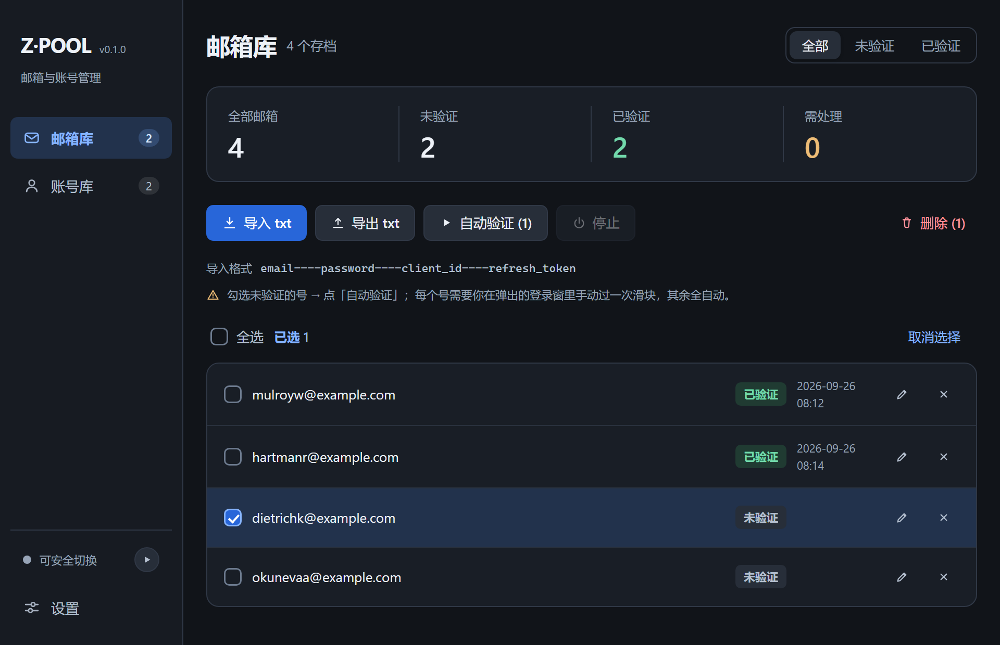
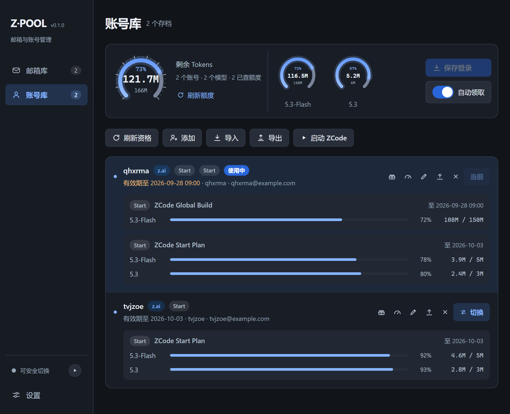

# Z·POOL

[](LICENSE)
[](https://tauri.app)
[](../../releases)

[简体中文](README.md) ｜ **English**

Z·POOL is a Windows desktop application built with Tauri 2. It manages ZCode / Z.ai account identities, an Outlook mailbox pool, and per-account quotas and plans in one place.

## Screenshots





## Features

### Account library

- Store multiple login identities and switch between them in one click. The current login is archived before every switch, so no account is ever lost.
- Supports both BigModel and z.ai sign-in. Adding an account never disturbs the login you are using.
- Can relaunch ZCode automatically after a switch.

### Quotas and plans

- Aggregates remaining quota across all accounts, grouped by model, with plan, quota window, reset time and expiry.
- Checks which plans are claimable, and claims them manually or on a fixed schedule.

### Mailbox pool

- Imports `email----password----client_id----refresh_token` files and reads Outlook / Hotmail verification mail.
- Runs signup, mail pickup, verification and authorization in batches. The slider CAPTCHA is completed manually.
- Supports re-authorization, credential updates and status filtering.

## Installation

### Prebuilt binaries

Download the package for your platform from the [Releases](../../releases) page:

| Platform | File |
| --- | --- |
| Windows | `*_x64-setup.exe` |
| macOS | `*_universal.dmg` |
| Linux | `*.deb` / `*.AppImage` |

The binaries are not code-signed, so the system may warn about an unknown publisher on first launch.

### Building from source

Requirements: Node.js 18 or newer, stable Rust, and — on Windows — the GNU toolchain `stable-x86_64-pc-windows-gnu`.

```powershell
npm install
npm run build
Set-Location src-tauri
cargo +stable-x86_64-pc-windows-gnu build --release --features tauri/custom-protocol
```

The binary is written to `src-tauri/target/release/zcode-pool.exe`. To also produce the portable build and the installer:

```powershell
npm run dist
```

After editing i18n strings, `npm run check:i18n` verifies that the Chinese and English tables stay in sync.

## Usage

1. **Add an account** — in the account library, click *Add* and sign in through the window that opens. The account is stored automatically and your current login is untouched.
2. **Switch accounts** — click *Switch* on a row. ZCode is closed and restarted so the new login takes effect.
3. **Verify mailboxes** — in the mailbox pool, click *Import txt*, tick the mailboxes you want, then click *Auto-verify*. Each account needs one manual slider check.
4. **Claim plans** — click *Refresh* to see what each account can claim, then *Claim* manually or enable *Auto claim* to check on a fixed interval.

## Data and security

- Accounts, mailboxes and settings live under `~/.zcode-pool/`. Everything stays local.
- `mail.json` stores mailbox passwords and refresh tokens in plain text. Do not commit it or share it.
- Exported accounts contain only z.ai / BigModel credentials, provider config and the device identity. Third-party provider keys, SSH passwords and relay credentials are stripped.
- Logs are written to `%LOCALAPPDATA%\com.zpool.app\logs\oauth.log`.

## Disclaimer

This project is shared for technical learning only. Please comply with the relevant terms of service and laws, and use it at your own risk.

## Credits

Parts of the code and design reference these MIT projects:

- [zcode-switch](https://github.com/pjpv/zcode-switch)
- [OutlookEmail](https://github.com/assast/outlookEmail)

## License

[MIT](LICENSE)
