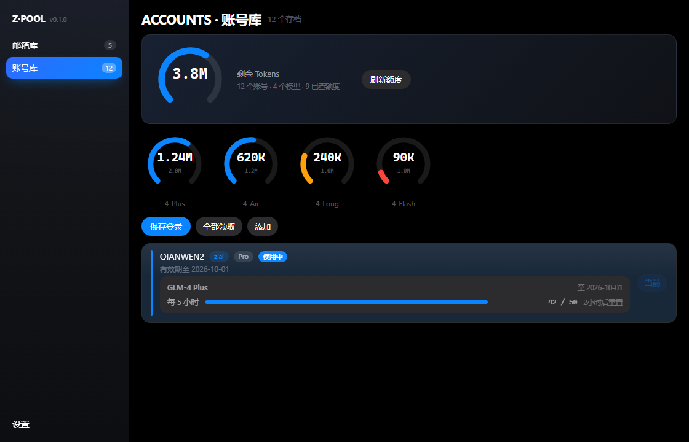

# Z·POOL (zcode-pool)

**简体中文** ｜ [English](README.en.md)

Tauri 2 桌面工具，把「**邮箱池 → 批量注册验证 Z.ai 账号 → 账号切换**」这条链路收进一个 app。



读信**直连微软 Graph**（用账号自带的 `client_id` + `refresh_token`），**不依赖任何外部邮箱程序**。自动注册里唯一的体力活是过滑块——那个是云端人机校验，绕不过，其余全自动。

---

## 功能

### 📮 邮箱库

- **导入**：选一个账号文本文件，每行一个账号，字段用 `----` 分隔：

  ```
  email@outlook.com----password----client_id----refresh_token
  ```

  只取前四段；已存在的邮箱不覆盖，只计「跳过」。库里也能**导出**回同样的文本。
- **状态**：`未验证 / 已验证 / 失败 / 需重新授权`。**以本地记录为准**——只有真的跑通「注册 → 邮箱验证 → 授权入库」才置「已验证」，不查外部。
- **直连取信**：拿账号自带的凭据换微软 token 读邮件，按时间倒序找最新的 Z.ai 验证链接（自动跳过「欢迎邮件」里那种非验证链接）。令牌轮换时自动回写。
- **更新凭据**：行内「✎」粘一行新的覆盖掉（换了 refresh_token 时用）。
- **内置重新授权**：refresh_token 失效时点「重新授权」→ 走**微软设备码流**（用该邮箱自己的 client_id），在这边输个码就能拿到新授权，**不用再开别的工具**。

### ✅ 批量自动验证

勾选未验证的号 → 点「自动验证」→ **逐个**（串行）弹登录窗：

1. 助手自动填注册表单（昵称随机 6 位、邮箱密码取自邮箱池）、自动提交；
2. **你在登录窗里手动过一次滑块**（云端人机校验，绕不过）——过完其余全自动；
3. 自动从邮箱取验证链接并打开、完成授权、新账号入库、把该邮箱标「已验证」，然后下一个。

跑完给**结果清单**（谁成功谁失败 + 原因），失败的可以**一键重试**。

> 不做并发：同 IP 多号并发注册更容易触发风控，收益也不大（滑块本来就得一个个过）。想要的人可以自己改。

### 💳 账号库

- **仪表盘**：顶部是**汽车刻度盘**式的汇总——总剩余 Tokens + 每个模型一个表盘（中心是 token 数，剩余低时转橙/红）。额度**按模型累加**，每 10 分钟自动刷新，也可手动点「刷新额度」。
- **一键切换**：在多个 ZCode 账号之间切换登录身份。切换是**冷切换**（关掉 ZCode → 换登录态 → 重启，设备身份才会生效）；切换前自动保全当前登录，绝不丢号。
- **添加账号**：工具内 OAuth 登录新号（BigModel / z.ai 双入口），纯手动，**不影响当前登录**。
- **领取**：列表里直接看每个账号的套餐 / 额度 / 有效期，支持一键领取与自动领取。

---

## 构建

需要 **Node 18+** 与 **Rust**（stable）。

```bash
npm install
npm run tauri build        # 产物在 src-tauri/target/release/
```

打包安装包（可选）：`npm run dist` 会把便携版 exe 和安装包收进 `release/`。

### 各平台

| 平台 | 打包目标 | 说明 |
|---|---|---|
| Windows | `nsis` | 默认；WebView2 运行时系统多已自带 |
| macOS | `dmg` / `app` | `npm run tauri build -- --bundles dmg,app` |
| Linux | `deb` / `appimage` | `npm run tauri build -- --bundles deb,appimage`；需装 WebKitGTK 等系统依赖 |

> **Windows / MSVC 链接报错？** Tauri 2 用 `custom-protocol` 特性区分 dev / 生产。若你手动 `cargo build`，**必须带这个特性**，否则编出来的是 dev 版（运行时会去连 vite dev server，白屏）：
> ```bash
> cargo build --release --features tauri/custom-protocol
> ```
> 若报 `LNK1181: cannot open input file 'kernel32.lib'` 之类，是 Windows SDK 没装全；用 GNU 工具链可绕过：`cargo +stable-x86_64-pc-windows-gnu build --release --features tauri/custom-protocol`。

---

## 数据位置

- 账号库 / 邮箱池 / 设置：`~/.zcode-pool/`
  - 邮箱池：`~/.zcode-pool/mail.json`（明文，含邮箱密码与 refresh_token）
  - 账号库：`~/.zcode-pool/accounts/<id>.json`
- 日志：`%LOCALAPPDATA%\com.zpool.app\logs\oauth.log`（Windows）/ `~/Library/Logs/com.zpool.app/`（macOS）

---

## 致谢

本项目的部分代码与设计参考了以下 MIT 项目，版权声明见 [LICENSE](LICENSE)：

- [zcode-switch](https://github.com/pjpv/zcode-switch) —— ZCode 账号切换
- [OutlookEmail](https://github.com/assast/outlookEmail) —— 多邮箱管理（Graph / IMAP）

## 许可证

MIT，见 [LICENSE](LICENSE)。
