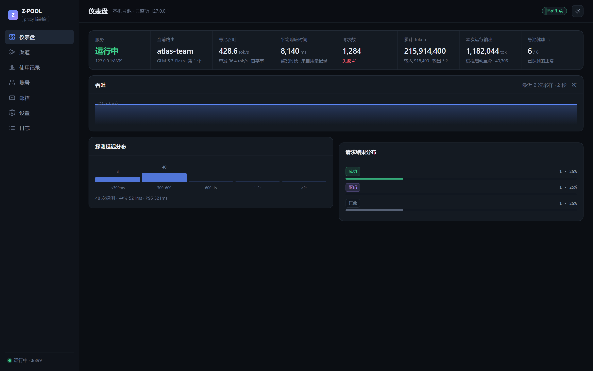
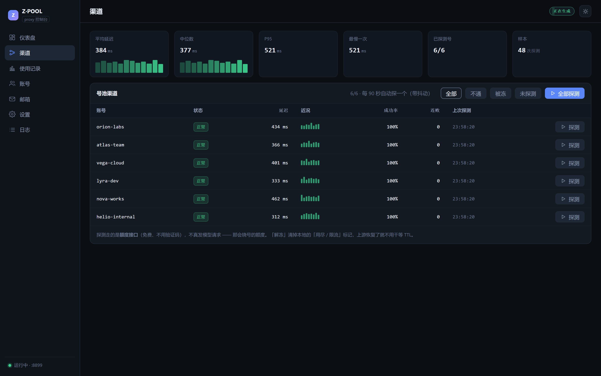
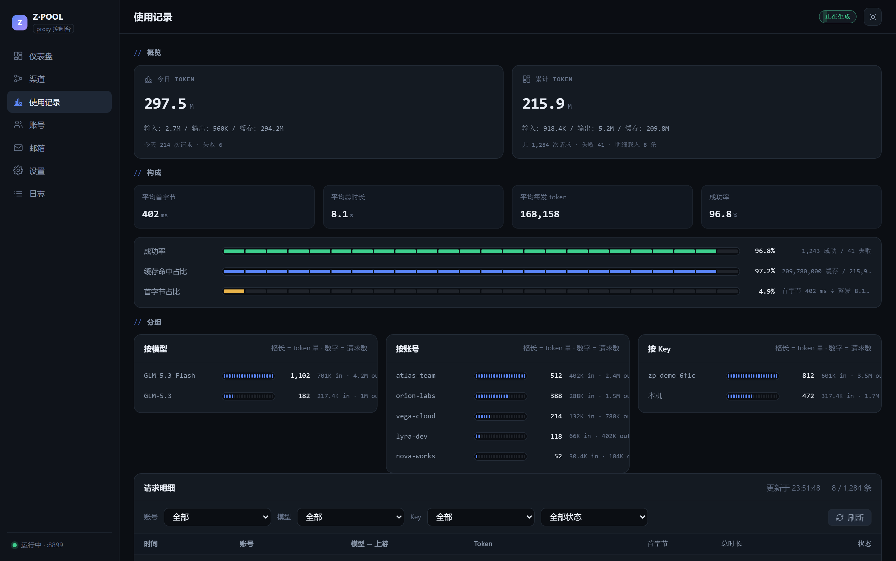
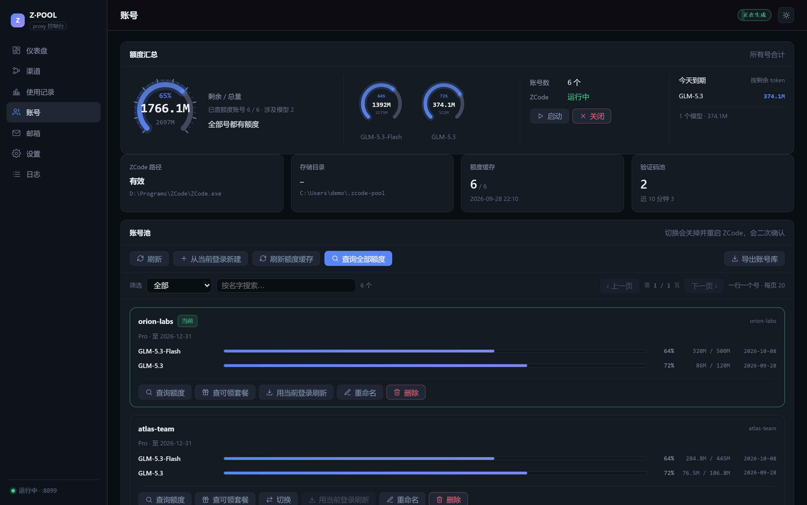
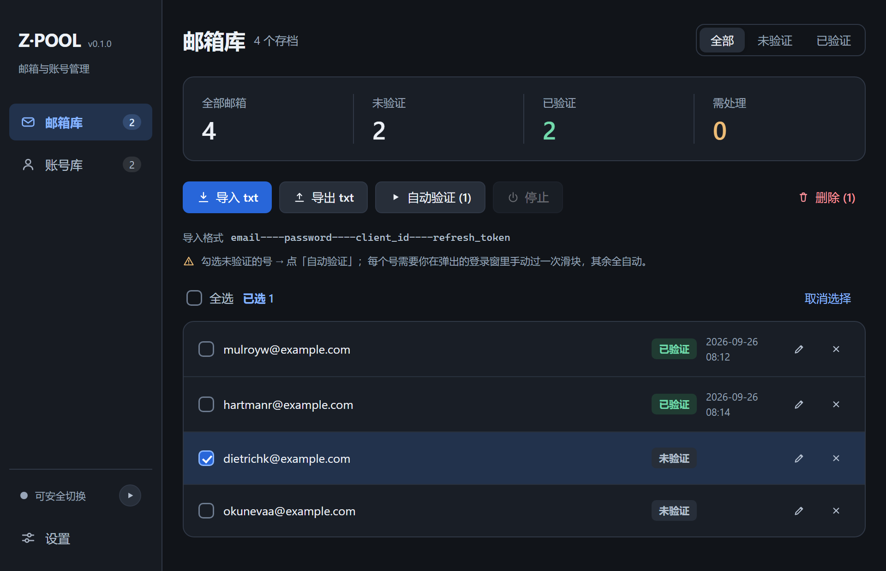
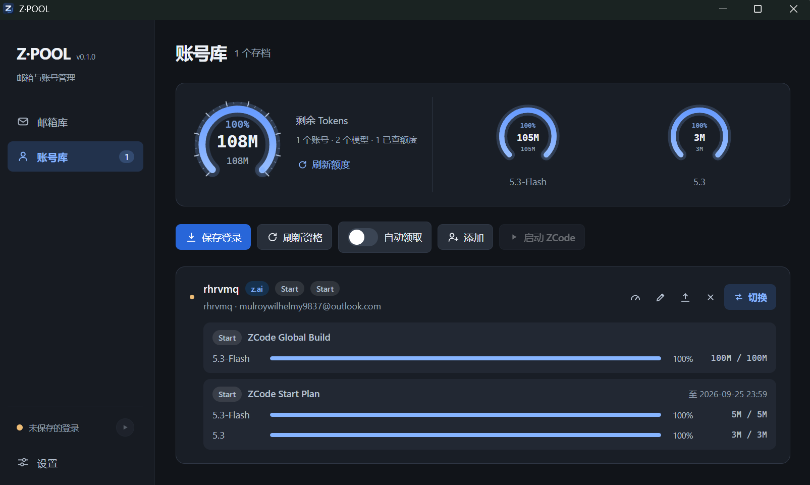

# Z·POOL

[](LICENSE)
[](https://tauri.app)
[](../../releases)

**简体中文** ｜ [English](README.en.md)

Z·POOL 是一个基于 Tauri 2 的桌面工具，把 ZCode / Z.ai 的多账号登录身份、Outlook 邮箱池和各账号额度集中管理，
并对外提供一个带 **Web 管理台**的本地代理接口，让 pi-agent、LobeChat 这类第三方应用直接吃上号池里的额度。

## 界面预览

**Web 管理台**（浏览器打开 `http://127.0.0.1:8899/proxy`，改页面不用重编译）

| 仪表盘 | 渠道健康 |
| :---: | :---: |
|  |  |

| 使用记录 | 账号池 |
| :---: | :---: |
|  |  |

**桌面面板**（邮箱库 / 账号库）

| 邮箱库 | 账号库与额度 |
| :---: | :---: |
|  |  |

## 功能特性

### proxy 网关 + Web 管理台

- 对外提供 Anthropic 协议接口（`http://127.0.0.1:8899/v1/messages`），客户端填上就能用号池的额度。
- **自带管理台**：反代开关、监听地址、端口、API Key、选号策略、模型策略、模型映射都能在浏览器里改，不用回桌面面板。
- **监听地址可切**：默认只监听本机；切到局域网可访问时**强制要求先建 API Key**，否则同网段的人能烧你的额度。
  鉴权规则是「本机回环免验，外部必须带 Key」。
- **模型策略**：`自动回退`（请求的模型全库没额度时，换一个还有额度的）/ `指定模型`（锁死一个，用完也不换）。
- **模型映射**：官方换模型名或下线某模型时，在网关里改名，不用去改每个客户端。
- **额度缓存落盘**：额度不再只活在内存里，重启不用从零再查一遍。
- **反代可配出站代理**：反代的请求不读系统代理；出口 IP 被判异常（`3012`）时，在设置里填一个 http / socks5 代理即可，不必常开全局 TUN。

### 管理台页面

| 页面 | 干什么 |
| --- | --- |
| 仪表盘 | 服务状态、当前路由、号池吞吐、首字节 / 总时长、近 60 次采样曲线、探测延迟分布、请求结果分布 |
| 渠道 | 一行一个号：状态、延迟、近况迷你图、成功率、连败、上次探测，可单个探测 / 解冻；顶部有整池延迟汇总（平均 / 中位数 / P95 / 样本数） |
| 使用记录 | 今日与累计 Token（输入 / 输出 / 缓存分列）、成功率与缓存命中率、按模型 / 账号 / Key 分组、可筛选可翻页的请求明细 |
| 账号 | 账号池一行一个号，状态与名字筛选 + 分页；额度环形仪表盘、今天到期的额度、与当前登录同步、启动 / 关闭 ZCode |
| 邮箱 | 邮箱池导入导出、批量验证、按状态筛选 |
| 设置 | 服务开关 / 监听地址 / 端口 / API Key / 出站代理 / ZCode 路径 / 选号策略 / 模型策略 / 模型映射 |
| 日志 | 原始运行流水，分页可翻 |

管理台还带一个**对话页**（`http://127.0.0.1:8899/`），用来直接验证反代通不通，支持流式输出和思考过程折叠。

### 账号库

- 保存多个登录身份，一键切换，切换前自动存档当前登录，不会丢失账号。
- 支持 BigModel 与 z.ai 两种登录入口，新增账号不影响正在使用的登录。
- 切换后可自动拉起 ZCode，无需手动启动。

### 额度与套餐

- 按模型汇总所有账号的剩余额度，展示套餐、额度周期、重置时间与有效期。
- 支持查询可领取套餐，并可手动领取或按固定间隔自动领取。

### 邮箱池

- 导入 `email----password----client_id----refresh_token` 格式的账号文件，读取 Outlook / Hotmail 验证邮件。
- 批量完成注册、取信、验证与授权流程；滑块验证码需手动完成。
- 支持重新授权、更新凭据、按状态筛选。

## 安装

### 下载预编译版本

前往 [Releases](../../releases) 页面下载对应平台的安装包：

| 平台 | 文件 |
| --- | --- |
| Windows | `*_x64-setup.exe`（安装包） |
| macOS | `*_universal.dmg` |
| Linux | `*.deb` / `*.AppImage` |

程序未做代码签名，首次运行时系统可能提示来源未知。

### 从源码构建

环境要求：Node.js 18 及以上、Rust stable，Windows 平台还需 GNU 工具链 `stable-x86_64-pc-windows-gnu`。

```powershell
npm install
npm run build
Set-Location src-tauri
cargo +stable-x86_64-pc-windows-gnu build --release --features tauri/custom-protocol
```

产物位于 `src-tauri/target/release/zcode-pool.exe`。如需一并生成便携版与安装包：

```powershell
npm run dist
```

修改 i18n 文案后，可用 `npm run check:i18n` 检查中英文词条是否一致。

## 使用说明

1. **添加账号**：在账号库点击「添加」，在弹出的登录窗口中完成登录，账号会自动入库，当前登录不受影响。
2. **切换账号**：在账号列表中点击「切换」。切换会关闭并重启 ZCode，使新的登录状态生效。
3. **批量验证邮箱**：在邮箱库点击「导入 txt」导入账号文件，勾选待验证的邮箱，点击「自动验证」；每个账号需要手动完成一次滑块验证。
4. **领取套餐**：点击「刷新资格」查看各账号可领取的套餐，随后手动「领取」，或开启「自动领取」按固定间隔检查。
5. **接入第三方应用**：在设置页确认反代已开启，把 `http://127.0.0.1:8899` 填进客户端（协议选 Anthropic）。
   本机访问不用填 Key；要从局域网其它设备访问，先把监听地址切到局域网并建一个 API Key。

## 数据与安全

- 账号库、邮箱池与设置均保存在 `~/.zcode-pool/` 目录，全部为本地数据。
- `mail.json` 以明文保存邮箱密码与 refresh token，请勿提交至版本库或对外分享。
- 导出账号时仅包含 z.ai / BigModel 的登录凭据、供应商配置与设备标识；第三方供应商密钥、SSH 密码及中继凭据会被剔除。
- 反代默认只监听 `127.0.0.1`；切到局域网可访问时**必须**至少配置一个 API Key，否则拒绝启动监听。
- 使用记录里的 API Key 只保留前 8 位，不落全量密钥。
- 运行日志位于 `%LOCALAPPDATA%\com.zpool.app\logs\oauth.log`。

## 免责声明

本项目仅用于技术分享与学习交流，请遵守相关服务条款与法律法规，自行承担使用风险。

## 致谢

部分代码与设计参考了以下 MIT 项目：

- [zcode-switch](https://github.com/pjpv/zcode-switch)
- [OutlookEmail](https://github.com/assast/outlookEmail)

## 许可证

[MIT](LICENSE)
